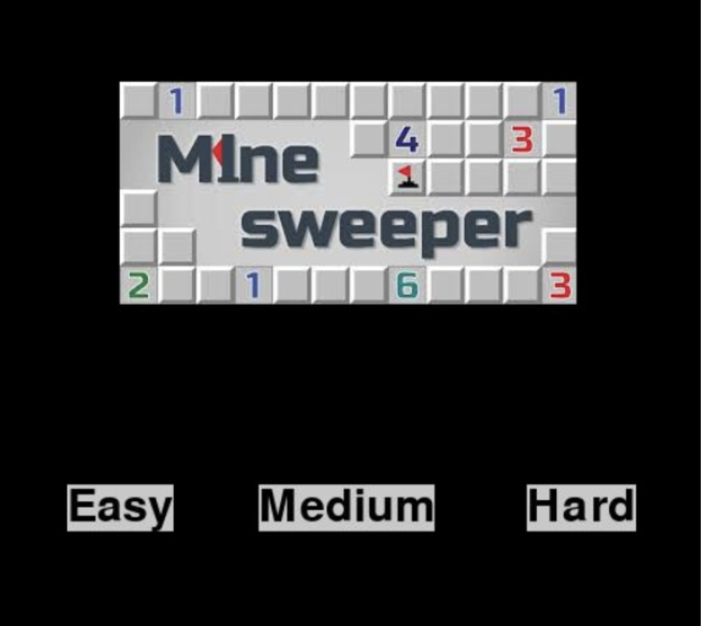

## Mine Sweeper Simulation
A python program that simulates the classic game of Mine Sweeper, using the pygame library. There are three levels of difficulty, which change the dimensions of the game board display. 

This was a group project created by Rebecca Lin, Peter Marion, Cynthia To, and Vaughn Wenner for OwlHacks 2020.

### Setup
Install pygame

`python3 -m pip install pygame`

The command above may not work for MAC OS, so instead try:

`python3 -m pip install -U pygame--2.0.0.dev12 --user`

### Contributers/Teammates
Rebecca Lin, Peter Marion, Cynthia To, Vaughn Wenner

